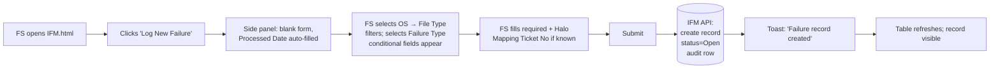
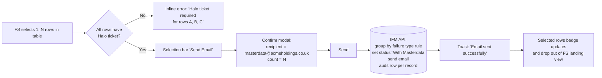
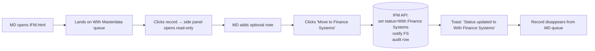
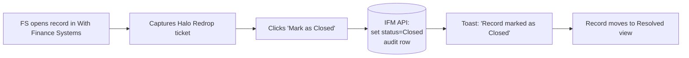
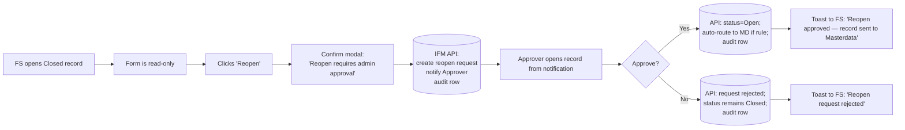

# Information Architecture — Integration Failure Management (IFM)

**Module:** FINOPS › Integration Failure Management
**Version:** 1.0 · 2026-06-10
**Aligned to:** [01_UX_Brief.md](01_UX_Brief.md) · [02_UX_Strategy.md](02_UX_Strategy.md) · MET-DS-V2 · WCAG 2.2 AA · `business/IFM/IFM_RBAC.xls`

---

## 1. IA at a Glance

```
FINOPS Portal
└── Integration Failure Management (IFM)
    ├── Records
    │   ├── All Records          (FS, Approver)
    │   ├── Open Records         (FS)
    │   ├── With Masterdata      (FS, MD)
    │   ├── With Finance Systems (FS)
    │   └── Resolved Records     (FS, Approver)
    │   └── Record Detail (side panel)
    │       ├── Details (tab)
    │       └── Audit Trail (tab)
    │
    └── Configuration                        (FS only)
        ├── Failure Types                    → IFM_FailureTypes.html
        │   └── Add / Edit Failure Type (side panel)
        └── Lookup Table                     → IFM_lookup.html
            ├── User Assignments (tab)
            │   └── Add / Edit Assignment (side panel)
            └── Failure Types (tab)
                └── Add / Edit Failure Type (side panel)
```

## 2. Web Sitemap

### Primary navigation (sidebar)

| Section | Item | Route / file | Default visibility |
|---------|------|--------------|--------------------|
| Records | All Records | `IFM.html#filter=all` | FS, Approver |
| Records | Open Records | `IFM.html#filter=all-open` | FS |
| Records | With Masterdata (Queue) | `IFM.html#filter=with-md` | MD (this is their landing), FS |
| Records | With Finance Systems | `IFM.html#filter=with-fs` | FS |
| Records | Resolved Records | `IFM.html#filter=closed` | FS, Approver |
| Configuration | Failure Types | `IFM_FailureTypes.html` | FS only |
| Configuration | Lookup Table | `IFM_lookup.html` | FS only |

### Global chrome (top nav)

| Element | Purpose | Role behaviour |
|---------|---------|----------------|
| Logo + module name | Brand + context | All roles |
| Notifications | Reopen requests, returned records, system messages | All roles, payload filtered by role |
| Role switcher | QA / demo / training tool to view as another role | All roles (UI only — never elevates server permissions) |

### Page-level affordances on `IFM.html`

- **Page header actions:** `Send Email` (FS), `Log New Failure` (FS).
- **Role banner:** sits under header — single sentence stating active role + what they can do.
- **Status card row:** quick-filters; cards visible to a role are filtered by `data-role-allow`.
- **Toolbar:** search, OS filter, failure-type filter, column chooser, export.
- **Records table:** primary working surface.
- **Selection bar:** appears when ≥1 row checked — Clear + Send Email (FS only).
- **Side panel:** opens for create / edit / view; tabs Details + Audit Trail.

## 3. Mobile Sitemap (responsive web)

Same sitemap, collapsed:

- Top nav: hamburger → sidebar overlay.
- Status card row: horizontal scroll on small screens.
- Side panel: full-screen sheet on screens narrower than 768px.
- Table: condensed view — primary columns only (Status, Failure Type, Filename, Client Code, Halo Ticket). Secondary columns accessible via row expand.
- Role banner stays sticky under the top nav.

> Mobile-first principles: progressive disclosure, single primary action per screen, large touch targets (≥ 44×44px), no horizontal scroll within the table view (only the card row).

## 4. Navigation Model

### Persistence
- Role selection: `localStorage[fionaIfmRole]` — preserved across all IFM pages, cleared only on explicit logout (out of scope of v1 switcher).
- Status filter: reflected in `location.hash` (e.g. `#filter=with-md`) so deep-links work and back/forward navigates filters.
- Sidebar state (collapsed / expanded): per-user preference in `localStorage`.

### Cross-screen handoff
| From | To | Trigger | Hand-off carries |
|------|----|---------|------------------|
| `IFM.html` | `IFM_FailureTypes.html` | Sidebar “Failure Types” | None |
| `IFM.html` | `IFM_lookup.html` | (Future) Sidebar “Lookup” | None |
| Notification | `IFM.html#record=F-NNNN` | Click | Record ID, auto-open side panel on Audit tab |
| Notification (Approver) | `IFM.html#filter=closed&record=F-NNNN` | Click | Filter set to Closed, side panel open |

### Keyboard / accessibility
- Tab order on `IFM.html`: Top nav → role switcher → page actions → status cards → toolbar → table rows (row + per-row action) → pagination → side panel (when open) → modal (when open).
- `Escape` closes side panel and any modal.
- Status cards behave as `role="listitem"` with `tabindex="0"` and respond to `Enter` / `Space`.

## 5. Role-Based Access Matrix

Source: `business/IFM/IFM_RBAC.xls`. Three roles × every screen / action / status combination.

### 5.1 Page access

| Page | Finance Systems | Masterdata | Approver |
|------|:---------------:|:----------:|:--------:|
| IFM Records list | ✅ | ✅ (filtered to With Masterdata only) | ✅ (read-only) |
| Record side panel — Details | ✅ (edit per status) | ✅ (read-only, only With Masterdata records) | ✅ (read-only, only Closed) |
| Record side panel — Audit Trail | ✅ | ✅ | ✅ |
| Failure Types config | ✅ | ❌ | ❌ |
| Lookup Table config | ✅ | ❌ | ❌ |

### 5.2 Status visibility per role

| Status filter | FS | MD | Approver |
|---------------|:--:|:--:|:--------:|
| All Records | ✅ | ❌ | ✅ |
| Open | ✅ | ❌ | ❌ |
| With Masterdata | ✅ | ✅ (default landing) | ❌ |
| With Finance Systems | ✅ | ❌ | ❌ |
| Closed (Resolved) | ✅ | ❌ | ✅ (default landing) |

### 5.3 Action matrix

Status transitions and actions, by role.

| Action | FS | MD | Approver | Notes |
|--------|:--:|:--:|:--------:|-------|
| Log New Failure (create with status `Open`) | ✅ | ❌ | ❌ | FS-only |
| Edit record — fields | ✅ on Open, With Masterdata, With Finance Systems | ❌ (read-only) | ❌ (read-only) | Form fields disabled when role can’t edit |
| Edit record — fields when Closed | ❌ (read-only until reopened) | ❌ | ❌ | Reopen required first |
| Set status → `With Masterdata` (Send Email) | ✅ (requires Halo ticket) | ❌ | ❌ | Bulk or single |
| Move status → `With Finance Systems` | ✅ (revert from FS panel) | ✅ (when status = With Masterdata) | ❌ | MD-side action is the primary handoff |
| Add comment / note | ✅ | ✅ (only on With Masterdata records) | ❌ | Notes visible to all roles |
| Mark as Closed | ✅ | ❌ | ❌ | Final review by FS |
| Request Reopen on Closed record | ✅ | ❌ | ❌ | Creates a pending request, does not change status |
| Approve / Reject Reopen | ❌ | ❌ | ✅ | Approve → status returns to `Open` + auto-routed back to Masterdata if rules apply |
| View Audit Trail | ✅ | ✅ | ✅ | Universal read access |
| Manage Failure Types | ✅ | ❌ | ❌ | Config-only |
| Manage Lookup Table | ✅ | ❌ | ❌ | Config-only |

### 5.4 Field-level rules (Data Capture form)

| Field | Required | Visibility | Notes |
|-------|----------|------------|-------|
| Processed Date | ✅ | Always | Autofills today, editable |
| Operating System | ✅ | Always | Atlas / Onestep / Nexum / Fleet / Genesys / Exodus |
| File Type | ✅ | Always | Filtered by OS (Atlas → CIR/CPR/Daily Journal/OPR; Nexum → MAARINV autofill; Onestep → BailiffSummary autofill; others → Standard) |
| Failure Type | ✅ | Always | Bad Fail · Missing Customer Translation · Missing Supplier Translation · Customer on Hold · Supplier on Hold · Missing Client Fund Code · Period closed · Other |
| Other Reason | Conditional | Failure Type = `Other` | Free text |
| D365 Supplier No | Conditional | Failure Type = `Supplier on Hold` | Free text |
| D365 Customer No | Conditional | Failure Type = `Customer on Hold` | Free text |
| Filename | ✅ | Always | Free text |
| Client Code | ✅ | Always | Free text |
| Parent Group | ✅ | Always | Pick from defined list (Burlington, Acme …) |
| Client Name | ❌ | Always | Free text |
| X3BP code · X3supp | ❌ | Always | Free text |
| Invoice Number · Case No | ❌ | Always | Free text |
| Fees Amount · Commission Amount | Conditional (✅ if CIR) | File Type = `CIR` | Numeric |
| clientamount · feeamount · costamount · vatamount · defaultervatamount | Conditional (✅ if CPR) | File Type = `CPR` | Numeric |
| DebitAmount · CreditAmount | Conditional (✅ if Daily Journal) | File Type = `Daily Journal` | Numeric |
| Halo Mapping Ticket No | ✅ (before Send Email) | Always | Gate for status → With Masterdata |
| Halo Redrop Ticket No | ❌ | After Masterdata returns | Captured by FS pre-Closed |
| Notes / Comments | ❌ | Always | Visible to FS + MD |

## 6. Status Taxonomy & Transitions

### Canonical statuses
1. **Open** — newly logged, awaiting routing decision.
2. **With Masterdata** — assigned to Masterdata team for translation/lookup fix.
3. **With Finance Systems** — returned to FS for redrop / final action.
4. **Closed** — resolved, audit-locked unless reopened.

### Transition rules

```
Open ─┬─► With Masterdata          (FS · Send Email · requires Halo ticket)
      └─► With Finance Systems     (FS · internal handling, no MD needed)

With Masterdata ─► With Finance Systems   (MD · Move to Finance Systems)

With Finance Systems ─┬─► Closed                 (FS · Mark as Closed)
                      └─► With Masterdata        (FS · Revert / Re-send)

Closed ─► Reopen Requested → ─┬─► Open  (Approver · Approve)
                              └─► Closed (Approver · Reject)
```

### Two valid lifecycles
- **Long path:** Open → With Masterdata → With Finance Systems → Closed (translation rules required).
- **Short path:** Open → With Finance Systems → Closed (handled internally, no Masterdata involvement).

## 7. Data Flows

### 7.1 Log a failure (FS)



### 7.2 Send to Masterdata (FS, bulk)



### 7.3 Masterdata returns record



### 7.4 Resolve



### 7.5 Reopen



## 8. Notifications

| Trigger | Recipient role | Channel | Payload |
|---------|----------------|---------|---------|
| Status → With Masterdata (Send Email) | Masterdata DL | Email | Grouped per failure type rule, list of record IDs + Halo ticket links |
| Status → With Finance Systems (MD action) | FS team | In-app + email | Record ID, who returned it, optional note |
| Reopen request created | Approver | In-app + email | Record ID, requesting FS user, comment |
| Reopen approved | Originating FS | In-app + email | Record ID, new status |
| Reopen rejected | Originating FS | In-app + email | Record ID, rejection reason |

## 9. Empty / Edge / Error State Inventory

| Surface | State | Treatment |
|---------|-------|-----------|
| Records table | No records match filter | Empty state row with icon + “No records match your filters” + “Clear filter” link |
| MD queue | No records With Masterdata | “All caught up. New records will appear here as Finance Systems sends them.” |
| Approver queue | No reopen requests | “No reopen requests pending.” |
| Send Email | Missing Halo on ≥1 selected row | Inline error in selection bar; rows with missing Halo highlighted; Send Email disabled |
| Side panel | Record changed externally while open | Toast: “This record was updated by another user. Reload to see the latest.” + Reload button |
| Notifications | Notification target deleted | “This record is no longer available.” |
| Offline | Action attempted offline | Toast: “You’re offline. Action will retry when you’re back online.” (Phase 2+) |

## 10. WCAG 2.2 AA Considerations (IA-level)

- **Landmark structure:** `header[role=banner]` · `nav[aria-label="IFM navigation"]` · `main#main-content` · side panel `aside[role=dialog]` with `aria-modal="true"`.
- **Heading hierarchy:** H1 = page title (single per page); H2 = side-panel title; H3 = side-panel section titles.
- **Role banner:** `role="status" aria-live="polite"` so screen readers announce role changes.
- **Focus management:** opening the side panel moves focus to its close button; closing returns focus to the triggering row.
- **Skip link:** “Skip to main content” available on every page, targets `#main-content`.
- **Status announcements:** every toast is in a `role="status" aria-live="polite"` container.
- **Forms:** every input has a programmatic label, required fields marked with `*` + `aria-required`, error messages associated via `aria-describedby`.
- **Colour:** status differentiation is never colour-only — every badge has an icon + text.
